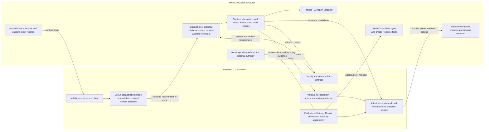
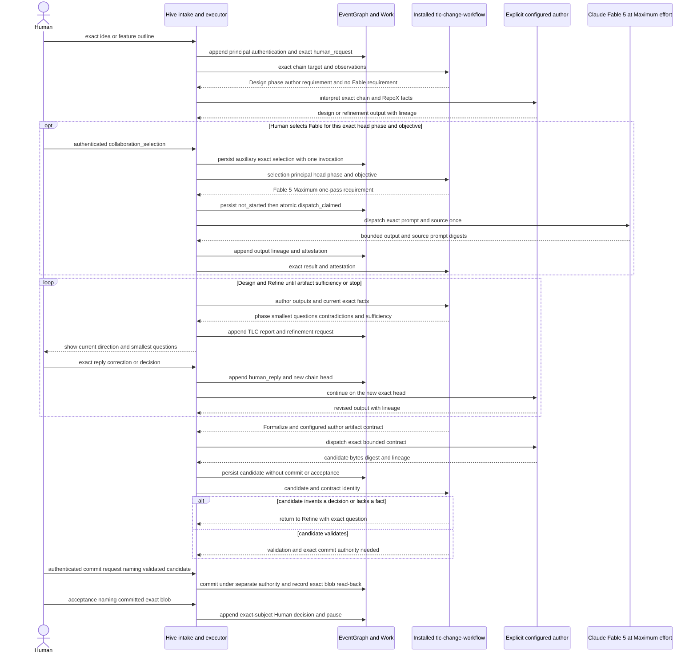
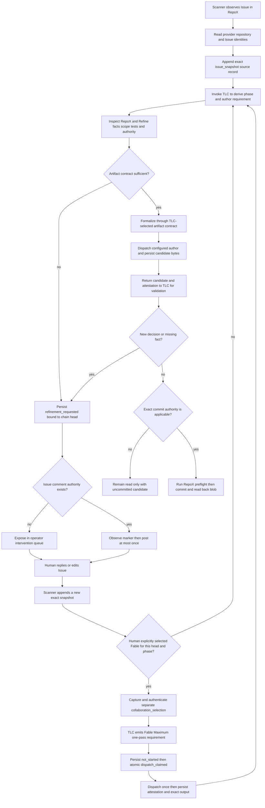
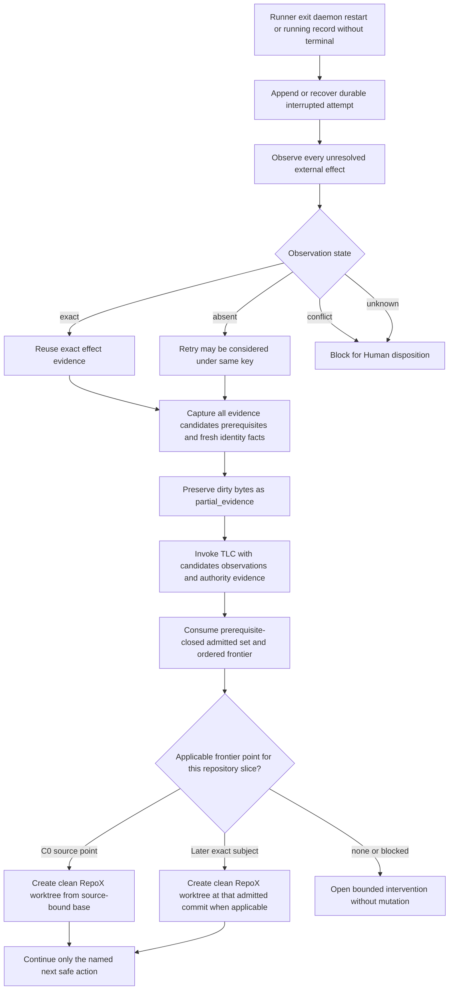

# Civilization adapter for the portable TLC change workflow

## Decision

Extend Hive's existing Civilization Factory v1 intake, scheduler, runner,
EventGraph, Work, and operator-projection seams to consume the installed
`tlc-change-continuation/v1` contract and invoke
`transpara-governance-gates:tlc-change-workflow`.

Do not build lifecycle policy into Hive. Do not add a new Civilization service.
Do not move task state, GitHub credentials, worktree placement, or recovery
machinery into TLC.

The ownership boundary is exact:

> TLC decides where work may safely continue. Hive performs the continuation.



Hive supplies facts and executes effects. TLC supplies policy-derived
predicates and reports. Neither side treats the other's record as authority.

## Design status and prerequisites

This repaired draft and its local implementation are authorized by the later
authenticated requests `implement this` and `implement 0.8.0`. Development may
bind exact candidate TLC skill and schema identities without claiming they are
published or installed. Runtime admission remains closed until authenticated
read-back matches the configured exact plugin, skill, contract, and content
digests. Publication, installation, provider review, and every protected
external effect require separate authority.

Data-recovery and authentication/identity specialist review remains required
before a readiness claim for production use.

The current development-only candidate binding is plugin version `1.1.0`,
contract `tlc-change-continuation/v1`, schema SHA-256
`2afab08e48111c02862c534e852709da90bb694e09ac15f49f8355630bf9dbb1`,
and skill SHA-256
`f4a2b3bcbb4a4072c392447de592fc9c9154ac1ed2f38e4a1d64dd0fe878fe03`.
These values support local exact-identity tests; they are not publication,
installation, adoption, or runtime-admission evidence.

No existing unmerged TLC 5.1 branch is a prerequisite. This design consumes the
portable contract and records an alignment seam only.

## Corrections to drafts v0.2.0 and v0.3.0

Draft v0.2.0 incorrectly made Fable Maximum the automatic route for every
authenticated Human semantic item, including Human-authored Issue content. That
conflated source capture with optional collaboration and allowed machine intake
to trigger a costly second author by implication.

This revision makes the default path an explicit exact-head author
requirement/result, permits Fable
Maximum only through an auxiliary authenticated Human selection scoped to one
existing chain head, phase, objective, and invocation, and prohibits selection
by scrape, bot, label, configuration, model, retry, or inheritance. It defines
one transport-neutral Design/Refine/Formalize sequence. It also keeps derived
model, artifact, review, and partial records outside the externally observed
source chain; adds the durable `dispatch_claimed` launch transition; and allows
local development against an exact candidate identity while runtime admission
still requires installed authenticated read-back. Hive persists and executes
the boundary records; TLC owns their validity and phase decisions.

## Current Hive evidence

The baseline is default-branch commit
`138472d26708cc6277625210ad46ae9b12aee10c`.

| Source | Git blob | Observed ownership or gap |
| --- | --- | --- |
| `AGENTS.md` | `99ce13ac1f9c0518d55ca8e29d54f69908d1b525` | Hive owns runtime orchestration and must preserve Human approval, identity, budget, and observability. |
| `.tlc/adoption.json` | `ad0f5029792e228c4a48180810020d7499048491` | Hive adopts TLC 5.0.0 in report-only mode with no adapter pin. |
| `README.md` | `b1fcccdd265c0022f90b5f2f43eac92ca4c5860a` | Civilization runtime and Human-idea CLI belong to Hive. |
| `docs/ARCHITECTURE.md` | `a8928db8e0190c4d4b378a9eb9cdaf4cf8426537` | Hive owns workspace Git management; EventGraph and Work are substrates; Site owns browser UI. |
| Existing Civilization FO | `228bb3cb17be0a4a3aa378768a24beafe1430428` | Requires Human-idea refinement, Issue intake, durable scheduling, recovery, and exact-head PR output. |
| Existing Factory v1 design | `e99653285b7295546088cb1d9ed75fc64f8bdcb9` | Accepted-order EventGraph queue, Work projection, fixed `tlc-v1` stages, and reconcile-before-retry baseline. |
| `pkg/hive/factoryv1/domain.go` | `9fd1bf4cf914113189316e4afdd6e2fc84f579e4` | Three intake channels, target repository, source references, authority scope, and fixed TLC record types. |
| `pkg/hive/factoryv1/intake.go` | `b4950f72d1880057cf7aa028f1c4a33b0b6d14ac` | Issue normalization, Human-idea revisions, accepted-order EventGraph truth, Work seeding, and accepted-order split repair. |
| `pkg/hive/factoryv1/scheduler.go` | `8a94f7c79b9a441bbea374b20fd49ddde19d2cd7` | Durable running transitions, runner reconciliation, replay, provider binding, terminal event then Work artifact gap. |
| `cmd/hive/factory_v1.go` | `09510fae3b53a424077f080555cc4bb9ba9a2c95` | Maps target repository names into Hive workspace roots and configures one author plus independent reviewer family. |
| `pkg/hive/issue_scan_draft_pr_create.go` | `692fab23cf99feddf9f73a9079d7111346c7e290` | Human-approved draft-PR reservation and effect; unresolved reservation blocks manual reconciliation. |
| `pkg/runner/worktree.go` | `2675dda810992e5a4aee4b3c1fc461cec1327560` | Hive-created temporary Git worktrees and branches; source repository controls the Git common directory. |

### Baseline conclusions

1. Hive is the primary repository owner for the remaining Civilization footprint.
2. EventGraph and Work already provide the durable storage seams; changes to
   their repositories are not assumed.
3. Hive already performs reconcile-before-retry for a running attempt, so the
   design repairs and generalizes that seam rather than replacing it.
4. Current Factory v1 normalizes an Issue directly into an accepted FO and its
   fixed twelve stages. That is incompatible with iterative TLC artifact
   selection and must be versioned, not silently rewritten.
5. Current terminal recording can split after the EventGraph append and before
   Work artifact attachment. Accepted-order replay does not repair stage twins.
6. Current repository mapping uses owner/name and filesystem conventions but
   does not prove provider numeric identity, Git common repository, and PR
   head/base repository equality as one pre-effect predicate.

## Versioned runtime path

Introduce Hive runtime vocabulary `civilization-tlc-continuation/v1`. Existing
`factory-v1` and `tlc-v1` events remain readable and immutable. New orders opt
into the continuation path only when their accepted source record names the
exact installed TLC contract identity.

The new path reuses the current Factory v1 package seams but does not append
legacy success transitions on behalf of TLC. Its durable truth is:

```text
source chain
  -> TLC invocation and report
  -> provider dispatch attestations and candidate records
  -> executor attempt and effect intents
  -> executor observations
  -> evidence candidates and prerequisite references
  -> next TLC invocation
```

The selected TLC M/I/D/H ladder determines applicable evidence. Hive does not
force every order through a twelve-stage list.

## Record ownership

All new records contain `schema_version`, stable record ID, chain ID and head,
exact subject, source or payload digest, causal predecessor IDs, principal and
capture identities, transport authentication evidence where applicable,
observed time, and record digest.

| Record | Hive responsibility | TLC responsibility |
| --- | --- | --- |
| `source_record` | Capture, authenticate principals, persist, and replay exact bytes without policy mapping. | Validate the chain and exact source head. |
| `collaboration_selection` | Capture only an explicit authenticated Human selection and persist its exact head, phase, objective, profile, and one-invocation bound. Never infer or renew it. | Validate selection against Human policy and emit either one bounded collaboration requirement or no requirement. |
| `collaboration_phase` | Persist and project TLC's reported phase without treating it as stage or evidence. | Derive `design`, `refine`, or `formalize` and validate transitions. |
| `refinement_requested` | Persist and surface questions; optionally post when authorized. | Produce bounded questions and contradictions. |
| `author_requirement` | Persist TLC's role-only exact-head author requirement without treating it as a provider command or grant. | Select the role, phase, objective, input bindings, and required identity disclosures without naming a provider. |
| `route_requirement` | Persist a TLC-selected collaboration or review requirement without treating it as a command or grant. | Select the required profile, model, effort, prompt bindings, role, and lineage constraints. |
| `provider_invocation` | Bind provider, credentials outside records, dispatch exact prompt, and persist argv/result attestation. | Validate attestation against the requirement and assign evidence credit or none. |
| `artifact_contract` | Persist and deliver the contract to the configured author. | Select artifact kind, template, required fields, and exact-source bindings. |
| `artifact_candidate` | Dispatch author, persist exact bytes and lineage, and submit for validation. | Validate contract conformance, policy, and sufficiency. |
| `artifact_commit_observation` | Commit only under separate authority and read back path, commit, blob, and digest. | Revalidate exact committed bytes for C3 eligibility. |
| `tlc_invocation` | Record installed contract, runner, input digest, attempt, and budget. | Define exact invocation input and output. |
| `tlc_report` | Validate schema, persist exact output, and expose fields verbatim. | Produce state, track, contract, validation, sufficiency, affinity, admitted evidence, frontier, review credit, authority applicability, and next actions. |
| `repository_observation` | Read Git and provider identities and persist observations. | Compare observations to source affinity. |
| `effect_intent` | Persist operation identity before external write. | Report prerequisite and exact authority needed. |
| `effect_observation` | Observe provider/Git state after attempt or interruption. | Decide whether observation satisfies an applicable evidence predicate. |
| `evidence_candidate` | Persist scoped C0–C7 candidate, prerequisites, and dual-store projection without ranking. | Admit or reject, compute prerequisite closure, and derive the ordered frontier. |
| `authority_evidence` | Authenticate and read back external grant records. | Evaluate literal applicability to one action and exact subject. |
| `partial_evidence` | Capture incomplete bytes and quarantine source. | Assign no credit and report disposition. |
| `intervention_required` | Persist and surface bounded Human question. | Name missing fact, conflict, blocker, or authority. |

## Source capture and refinement

Hive carries one shared collaboration sequence for both transports:

| Phase | Hive behavior | TLC decision |
| --- | --- | --- |
| `design` | Submit an exact author result or consume TLC's role-only author requirement; optionally capture and execute one valid Human-selected collaboration requirement. | Explore intent, alternatives, constraints, contradictions, and decision points. |
| `refine` | Persist and surface the smallest questions, capture new Human replies or Issue snapshots as new heads, and resubmit facts. | Resolve scope, non-goals, repository facts, dependencies, tests, specialists, and authority boundaries; evaluate artifact sufficiency. |
| `formalize` | Dispatch the configured author for the selected artifact contract, persist candidate bytes, and return them for validation. | Enter only on sufficiency; reject semantic invention and return to Refine. |

Hive does not advance these as runtime stages. It projects TLC's current phase,
and phase position earns no evidence or authority. Design and Refine may iterate
in either direction; a new exact source head triggers a fresh evaluation.

### Human selection affordance

Fable is an inactive optional control, not a visible mandatory step or automatic
retry. Hive never preselects it, schedules it from a score, or repeatedly asks
for it. When the Human wants a second semantic perspective, the control captures
one bounded objective and shows the exact head, phase, `max` effort, one-pass
limit, added Anthropic authorship lineage, and absence of review or authority
credit before submission.

The recommended uses are a genuinely consequential design fork, persistent
ambiguity after an exact author result has made it concrete, a cross-domain
semantic conflict, or a deliberate cross-family challenge. Routine extraction,
ordinary question generation, formatting, and every Issue scrape remain on the
explicit author-requirement path. A later Fable pass requires another fresh Human
selection; Hive may display the series invocation count but may not infer the
choice.

### Human idea path

Hive preserves every Human idea and reply as exact bytes and authenticates the
principal through the transport. It maps no Human policy and does not use local
validation as semantic sufficiency. Structural contract validation may reject
malformed records; TLC decides what facts are missing and which artifact
contract is truthful. Fable is absent unless the Human creates a separate exact
selection.



Hive executes every provider command as the host. TLC selects requirements and
validates returned attestations and evidence. No Human selection means no Fable
command. For a selected pass, failure to prove the exact Fable model, `max`
effort, readable source/prompt bytes, captured argv, completed exit, and matching
transport/in-session digests ends that pass without substitute output. The
Human source remains valid. Credentials never enter TLC input, output,
EventGraph, Work, or Site.

### Issue path

The scanner captures a full exact snapshot rather than immediately converting
the latest mutable Issue into an accepted FO.



The machine begins Design and Refine but cannot select Fable. Labels remain
routing hints and carry neither selection nor authority. A Human may add a
bounded selection in an authenticated reply; Hive captures it separately and
it expires after the one invocation, a new head, or a phase change. The comment
writer is an optional executor effect, not part of TLC and not required for
refinement when Site/operator delivery is available.

## Repository-affinity preflight

Hive resolves a source affinity repository before any worktree or external
write. It then creates a signed or otherwise authenticated observation bundle:

| Observation | Required proof |
| --- | --- |
| Provider repository | Numeric repository ID and canonical owner/name read from the provider. |
| Local checkout | Absolute Git common directory, origin URL, exact head, cleanliness, and mapping configuration digest. |
| Intended branch | Repository ID, base ref/commit, deterministic head ref, and no-fork rule. |
| Intended PR | Repository ID, base repository, head repository, base ref, and exact head commit. |

TLC returns `match`, `mismatch`, or `unknown`. Only `match` may proceed, and it
still grants no effect authority.

```mermaid
flowchart LR
    A["RepoX Issue or Human target"] --> B["Provider RepoX numeric identity"]
    B --> C["RepoX local Git common directory"]
    C --> D["RepoX branch and push remote"]
    D --> E["RepoX PR repository"]
    E --> F["RepoX head repository"]
    F --> G["RepoX base repository"]
    G --> H["TLC affinity match"]
    H --> I["Separately authorized executor effect"]
```



The filesystem worktree may be located under a Hive-managed workspace. "In
RepoX" means it shares RepoX's Git common repository and every provider effect
targets RepoX, not that a path string happens to contain `RepoX`.

### Cross-repository change

If a RepoX source reveals required RepoY work, Hive records
`cross_repository_source_required` and stops the RepoY slice. A Human or
authorized repository process must create an exact RepoY source. The two slices
share an aggregate `change_series_id`, but their worktrees, branches, authority,
reviews, and PRs remain repository-local.

## Worktree and branch lifecycle

For each repository slice Hive derives a stable workspace identity from
`repository_numeric_id + chain_id`. Each attempt adds an ordinal but does not
change source identity.

1. Read back the source checkout and obtain TLC affinity `match`.
2. Persist `worktree_create` intent and idempotency key.
3. Observe existing Git worktrees and branches for the same workspace identity.
4. Reuse only an exact clean match at the admitted commit.
5. Otherwise create a new worktree from RepoX's Git common directory at the
   exact admitted commit and create its RepoX branch.
6. Persist worktree and branch observations before running an author.
7. Never merge locally to main. Output remains a branch or draft PR pending its
   own authority path.

This continuation path must not call legacy `MergeToMain`.

## Durable evidence-candidate storage

Hive stores evidence candidates only after a complete unit boundary. Each
candidate contains the TLC class, subject scope and repository slice,
source-chain head, exact subjects, explicit prerequisite record IDs,
authority-evidence reference, EventGraph event ID, Work artifact ID, payload
digest, and executor observation digest. Hive assigns no rank to a class.

EventGraph is causal truth. Work is a query and task projection. Both store the
same normalized evidence-candidate payload digest.

### Dual-store append protocol

1. Normalize and digest the evidence-candidate payload.
2. Append the EventGraph evidence event with its idempotency key.
3. Attach the Work artifact with the same payload and EventGraph ID.
4. Append or expose a projection-complete observation only after both reads
   return the same digest.

A crash after step 2 leaves an EventGraph-only record. Replay may reconstruct
the Work projection from the exact EventGraph payload, but Hive submits the
candidate to TLC only after both reads match. A Work-only record or a digest
conflict cannot create causal truth, earns no candidate status, and opens an
intervention.

## Interruption and recovery

Hive already recognizes a durable running transition with no terminal result
and calls runner reconciliation before retry. The new path generalizes that
behavior to source, repository, model, artifact, review, Git, and GitHub
observations without letting Hive admit evidence or choose a resume point.



### Interrupted worktree rule

Hive does not reset or delete an interrupted worktree first. It records:

- source chain and attempt identity;
- Git common repository, base commit, current head, and branch;
- tracked diff digest and patch artifact;
- untracked path and content-digest manifest without secret contents;
- tool/provider outcome and author lineage; and
- capture failure or omission reason.

The old worktree is quarantined. Recovery uses a new clean worktree. Retention
and cleanup are executor policy and require secret-safe handling; neither state
earns TLC credit.

## External-effect protocol

Every external mutation uses:

```text
operation_id = stable order or slice identity plus effect kind plus ordinal
idempotency_key = digest of chain head plus effect kind plus exact intended subject
```

Hive writes intent before dispatch. Reconciliation never equates a timeout with
absence. Observation results are:

| Result | Meaning | Allowed next action |
| --- | --- | --- |
| `exact` | One externally observed object equals the intended exact subject. | Persist observation and reuse it. |
| `absent` | Authenticated read-back proves no matching effect exists. | Retry the same operation only if authority and budget still apply. |
| `conflict` | One or more incompatible objects exist. | Block and request Human disposition. |
| `unknown` | Provider outage, ambiguous read, or insufficient identity. | Block; no retry. |

Effect-specific correlation uses immutable markers where the provider permits:

- Issue comment: bot author, chain-head marker, question digest;
- branch push: RepoX numeric ID, exact head ref and commit;
- PR: RepoX numeric ID, exact base, head repository/ref/commit, chain marker;
- review: exact design blob or PR head and durable review identity;
- status: repository, context, exact commit, and provider record identity.

The current draft-PR reservation that demands manual reconciliation after an
unsettled reservation remains safe. Implementation may replace that stop with
the four-state observe-before-retry protocol only where provider reads are
strong enough to prove `exact` or `absent`.

## Runner boundary

Hive invokes one configured runner with JSON stdin. The request contains no
credential and names:

- exact installed TLC plugin and schema identity;
- source-chain records, principal authentication evidence, head, optional exact
  Human collaboration selection, and prior phase context;
- target repository identity and current observations;
- provider results and attestations, artifact candidates, review results,
  evidence candidates with prerequisites, and preserved partial references;
- requested action and authenticated external-authority evidence;
- attempt, provider, budget, and workspace identity; and
- operation `evaluate`, `execute_host_step`, or `reconcile`.

The runner launches an agent instructed to use the installed
`tlc-change-workflow`. If TLC emits a selected-collaboration or review route
requirement, Hive or its runner host resolves and executes that exact provider
binding. A separate role-only author requirement is satisfied by an explicitly
configured author or the authenticated interactive host. Every result returns
exact output plus invocation evidence to the workflow.
No selection produces no Fable dispatch. Hive never chooses a collaboration
phase or TLC route, computes reviewer independence, or marks a review credited.
It dispatches only from an explicit requirement rather than silently
interpreting the source in transport code.

The runner output is strict schema-validated JSON. Invalid stdout, hidden prose,
unknown fields, digest mismatch, provider mismatch, or missing durable reference
blocks the attempt. Runner stdout never grants authority.

## Authority model

Hive distinguishes:

1. source evidence describing requested behavior;
2. TLC evidence describing lifecycle predicates;
3. executor observations describing current state; and
4. authenticated external authority permitting one exact action.

Only item 4 can supply authority. Authority records name actor, repository,
action, exact subject, scope, expiry or duration, and exceptional denials. Hive
submits them to TLC for literal action-and-subject applicability and also applies
its own operating policy. Both must permit the exact dispatch. Hive re-reads the
external record immediately before dispatch and after recovery; neither Hive nor
TLC manufactures a grant.

An Issue grants routing and scope only. Human-authored Issue text does not grant
push, comment, PR, ready, closure, merge, or deployment merely because its author
is Human. A collaboration selection grants one semantic provider invocation
only after TLC validates it; it grants no repository effect or review credit.

## Operator projection

Hive exposes a read-only projection containing:

```text
order and change_series identity
source channel chain head and last refinement
TLC contract and installed package identity
collaboration phase optional Human selection and remaining invocation count
information state track and selected artifact ladder
selected-collaboration author and review requirements and attestation validation
artifact contract candidate validation and FO sufficiency
repository affinity and observations
current attempt and interruption state
prerequisite-closed admitted evidence frontier points and blocked slices
rejected candidates and exact reasons
preserved partial evidence references
review requirements attestations and credited exact-subject evidence
external effect observations
authority applicable missing expired or denied per action and subject
next safe action per frontier point and open Human intervention
```

Unknown or unavailable facts render `unknown` or `blocked`, never healthy. Hive
projects TLC report fields verbatim and adds no fallback governance default or
browser UI. A Site rendering change, if wanted, is a separately sourced
Site-repository slice under the RepoX affinity rule.

## Failure behavior

| Failure | Required behavior |
| --- | --- |
| Installed TLC skill or schema missing/mismatched | Block new continuation order; never use legacy `tlc-v1` as fallback. |
| No Human collaboration selection exists | Submit an exact author result or surface the role-only author requirement; issue no Fable command. |
| Collaboration intent is `not_started` | Atomically persist `dispatch_claimed`; only the process that completed that transition may launch the provider. |
| Recovery sees `dispatch_claimed` without an exact completed result | Persist `consumed_unknown`, block without retry, and require a fresh Human selection for another call. |
| Source principal cannot be authenticated | Preserve exact source, report authorship as unknown, and do not treat it as Human decision or authority. |
| Selection principal cannot be authenticated or TLC maps no collaboration policy | Block only the selected collaboration pass; do not default identity, model, or policy. |
| Machine, bot, label, setting, model, prior head, or prior phase asserts a selection | Reject the selection record and continue only the no-selection path. |
| Selection is stale, exhausted, wrong-phase, or permits multiple invocations | Reject it without inheritance, renewal, or fallback. |
| Selected Fable or reviewer identity, effort, prompt/source readability, argv, completed exit, or digest cannot be proven | End that invocation without collaboration or review result, substitute model, or credit. The source remains valid. |
| Formalize would invent a semantic decision or lacks a bounded fact | Preserve the candidate if useful, return to Refine, and surface the exact question. |
| Issue snapshot authorship incomplete | Preserve snapshot and report missing facts; no Human attribution or effect. |
| Artifact candidate fails TLC validation or committed blob differs | Preserve candidate, do not transfer validation or Human acceptance, and revalidate exact committed bytes if any. |
| RepoX observation mismatches checkout, worktree, branch, or PR | Stop before mutation or further effect; persist contradiction. |
| Worktree dirty after interruption | Preserve exact partial evidence, quarantine, and recover in a new clean worktree. |
| EventGraph evidence exists and Work twin is missing | Rebuild Work from exact EventGraph payload; do not submit the candidate until matching digest is read back. |
| EventGraph and Work evidence payloads conflict | Quarantine projection and request Human intervention. |
| External effect is `unknown` or `conflict` | Block without retry. |
| External effect is `absent` | Retry only the same operation under still-valid authority and budget. |
| TLC frontier contains only C0 | Start from source-bound base and assign no later credit. |
| TLC frontier contains incomparable repository slices | Keep points separate and execute only the applicable slice-local next action. |
| TLC requirement, report, candidate, collaboration selection, Human request, Issue, or label is presented as authority | Record authority missing and perform no effect. |
| Attempt or budget exhausted | Open one bounded Human intervention; do not silently restart. |
| Site or operator projection unavailable | Runtime may continue only if no missing authority or required Human input depends on it; projection reports outage when restored. |

## Implementation mapping

The primary local implementation surfaces are:

| Surface | Intended delta |
| --- | --- |
| `pkg/hive/factoryv1/continuation.go` | Strict contract decoding including required-field/null checks, installed-identity check, thin callable runner boundary, explicit Human selection, invocation-state transitions, and RepoX frontier consumption. |
| `pkg/hive/factoryv1/continuation_runtime.go` | Durable continuation envelopes, a durable compare-and-swap intent-store contract with a contention-tested reference store, EventGraph-first persistence, Work projection, split repair, and external-effect retry decisions. |
| `pkg/hive/factory_v1_eventgraph.go` | Typed causal records and exact-payload replay. |
| `pkg/hive/factory_v1_work.go` | Matching Work artifacts and split repair. |
| A later separately sourced command/API surface | Production runner configuration and operator entrypoint after installed identity and authority are available. |
| Existing issue-scan intake and PR files | Exact snapshots, optional comment effect, RepoX affinity, and idempotent provider read-back. |
| Existing worktree/runner surfaces | RepoX Git common directory validation, clean recovery worktrees, and partial preservation. |
| Existing operator projection | Truthful continuation and recovery fields only. |

This is a bounded local kernel, not production admission or external-effect
authority. A production intent store must satisfy the compare-and-swap
contract; a read followed by an unconditional write is nonconforming.
Command/API wiring remains a separately sourced follow-on.

## Cross-repository boundaries

- **TLC:** publishes the schema and skill under a separately authorized release
  and installation. Hive consumes; it does not vendor or copy them.
- **EventGraph:** existing append-only event interfaces are the first choice.
  A new substrate type requires a separate EventGraph source, design, authority,
  worktree, and PR.
- **Work:** existing task/artifact interfaces are the first choice. A substrate
  change is a separate Work slice.
- **Site:** may render Hive projection through a separate Site slice. Hive adds
  no UI.
- **Platform and `.github`:** no active implementation dependency.

## Verification plan

### Unit and contract tests

1. Exact source-record canonicalization, predecessor chain, and mutation
   rejection.
2. Issue snapshots with Human, bot, model, unknown, edited, and omitted-comment
   authorship.
3. Human-idea and Issue inputs with no collaboration selection, proving no Fable
   provider command or missing-policy failure.
4. Human selections across mapped, unmapped, unauthenticated, stale-head,
   wrong-phase, exhausted, multi-invocation, and multiple-Human chains.
5. Machine, bot, label, setting, prior-head, and prior-phase selection attempts,
   all rejected without selection inheritance.
6. Fable/author/reviewer requirement dispatch and attestation capture,
   including exact one-pass Fable Maximum, lower-effort, unreadable-source or
   prompt, mismatched argv, and incomplete-output failures.
7. Design/Refine iteration and Formalize return-to-Refine on missing facts or
   semantic invention, with no phase-derived evidence or authority.
8. Installed schema identity and strict request/result validation.
9. Artifact contract, candidate, TLC validation, commit read-back, and Human
   acceptance digest binding.
10. RepoX identity normalization using provider numeric ID, Git common dir,
   remote, branch, fork, PR head, and PR base facts.
11. Evidence-candidate persistence, candidate-input reordering, and proof of no
   Hive-side admission, ranking, frontier, or review-credit decision.
12. EventGraph/Work exact repair and conflict quarantine.
13. External observation states and deterministic idempotency keys.
14. Literal external-authority read-back and negative
    selection/request/Issue/label/report cases.
15. Partial evidence capture and secret-safe manifests.
16. Legacy event and order replay unchanged.

### Integration and adversarial tests

1. Two-turn Human idea Design/Refine/Formalize with no Fable dispatch,
   configured-author candidate generation, TLC validation, separately authorized
   commit, and Human acceptance of the committed blob.
2. One Human idea with an explicit exact-head Design or Refine selection that
   invokes Fable Maximum once and records lineage without gate credit.
3. Issue Design/Refine/Formalize through operator delivery with no machine Fable
   selection and, when authorized, one idempotent Issue comment.
4. Issue refinement where an authenticated Human reply explicitly selects one
   Fable Maximum pass and the following head cannot reuse it.
5. RepoX Issue with matching worktree and draft PR.
6. RepoX Issue with RepoY checkout, fork head, wrong PR base, ambiguous remote,
   or changed provider ID, all blocked before mutation.
7. Kill runner and daemon before and after each applicable C0–C7 candidate;
   resubmit all candidates and consume the deterministic slice-local frontier.
8. Kill before intent, after intent, during effect, after effect, and before
   observation for each external effect.
9. Dirty tracked and untracked bytes preserved, quarantined, and excluded from
   continuation credit.
10. EventGraph-only, Work-only, and conflicting twin records, with no candidate
   submission before exact dual-store agreement.
11. Missing TLC plugin/schema and invalid runner output, with no legacy fallback.
12. Exhausted budget, provider outage, and observation `unknown` with no retry.
13. RepoX C7 and RepoY C3 as incomparable frontier points whose actions and
    authority remain slice-local.
14. Reviewer requirement dispatch with same-family, wrong-subject, missing
    attestation, and interrupted results receiving no Hive-side credit.

### Product evidence

A later implementation requires one real non-production Issue and one Human
idea E2E. During each run the daemon is killed after a bounded effect intent and
must recover without duplicate comments, branches, PRs, statuses, or reviews.
The final projection must match EventGraph, Work, Git, and GitHub read-back.

Product E2E evidence belongs to Hive. Site rendering evidence belongs to Site
if that separate slice is authorized.

## Migration and compatibility

1. Preserve every legacy Factory v1 and `tlc-v1` record byte and decoder.
2. Add the versioned continuation record decoder and projection.
3. Permit local candidate-bound tests, but admit no production continuation
   order until the installed TLC contract identity is authenticated and
   schema-compatible.
4. Do not migrate an in-flight legacy order automatically. A Human chooses
   whether it finishes on the legacy route, stops, or restarts from a new exact
   source chain under the continuation contract.
5. Rollback disables new continuation admission and leaves durable records
   readable; it does not delete effects or reinterpret legacy history.

## Residual risks and Human decisions

1. Provider APIs cannot guarantee distributed exactly once. The design uses
   observe-before-retry and blocks on unknown, accepting reduced availability.
2. Preserved partial worktrees may contain secrets. Implementation needs a
   secret-safe manifest and bounded retention policy reviewed by the data
   recovery specialist.
3. Existing Hive has multiple Git/worktree paths. Implementation must select one
   continuation path and prove legacy paths cannot bypass RepoX affinity.
4. Optional Issue-comment delivery expands GitHub write authority. The default
   design works through operator projection and leaves comments disabled until
   exact authority exists.
5. Host-captured argv and dual digests attest binding but cannot prove internal
   provider behavior; signed attestation is a possible later design.
6. The current TLC bundle maps only Michael Saucier for the Fable collaboration
   profile. Another authenticated Human can use the ordinary path but cannot
   select that profile until a separately reviewed policy entry exists.
7. Codex/OpenAI and Claude Fable 5/Anthropic both authored this design. Formal
   CFADA requires a materially independent reviewer or an exact-subject Human
   reviewer-family exception; none is inferred.

## Stop conditions and non-authorizations

Stop if implementation would duplicate TLC semantics, map Human policy, choose
a collaboration phase, select or renew Fable without an exact authenticated
Human record, carry a selection across a head, phase, or completed invocation,
choose reviewer independence or credit, rank evidence, compute a frontier,
accept mutable labels or paths as identity, retry unknown effects, promote
partial bytes, delete dirty work before preservation, silently choose a
continuation point, silently repair conflicting dual-store truth, fall back to
or map the fixed stage list, or let a collaboration selection, TLC requirement,
artifact contract, candidate, report, Human request, Issue, or label grant an
effect.

This completed draft pauses for Human review. It authorizes no IADA, CFADA,
implementation, plugin installation, runtime invocation, Issue mutation,
worktree for implementation, branch, push, PR, review, status, merge, release,
deployment, settings, production action, value allocation, or other protected
effect.
